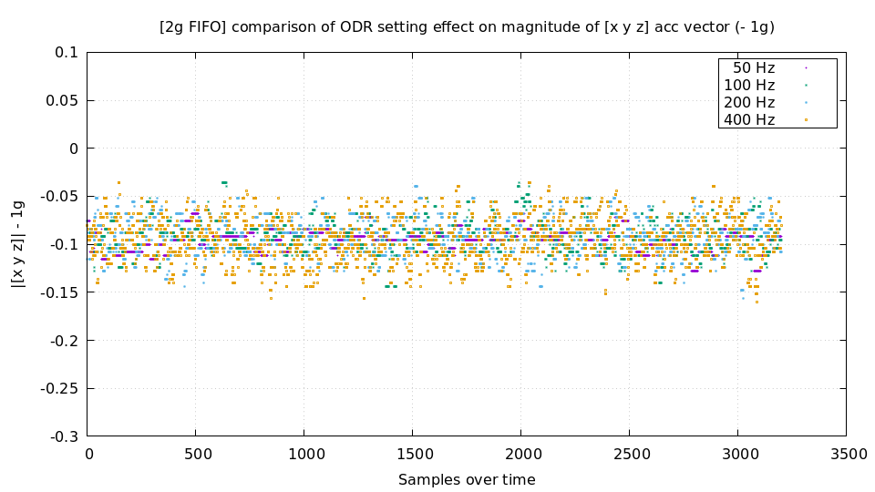
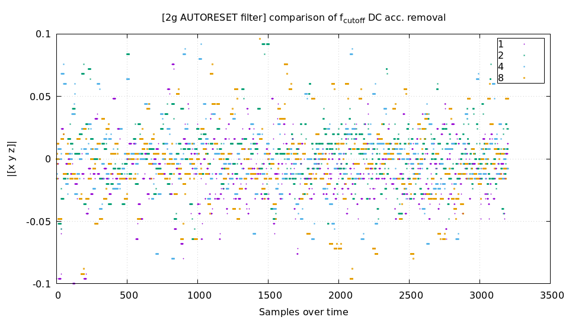
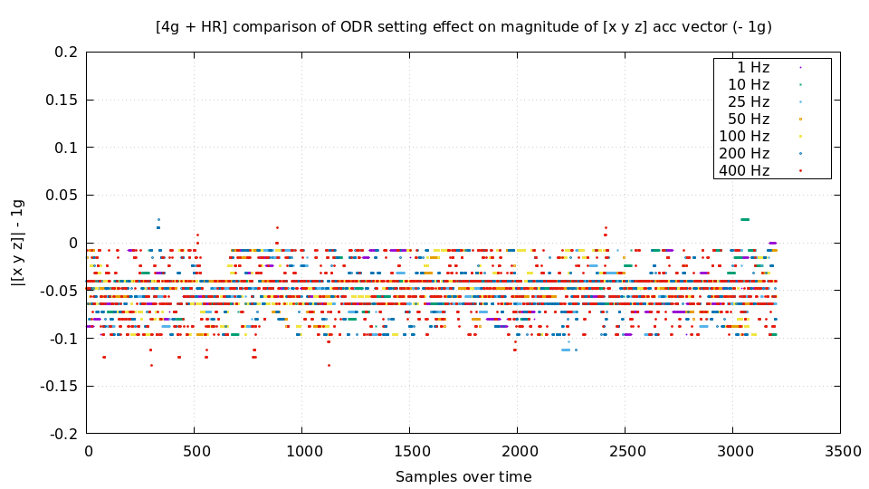
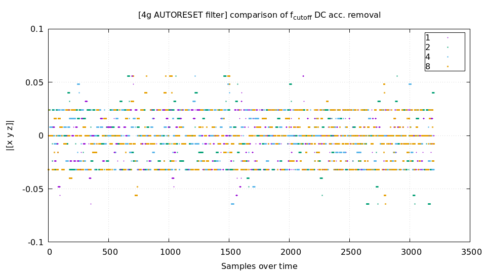
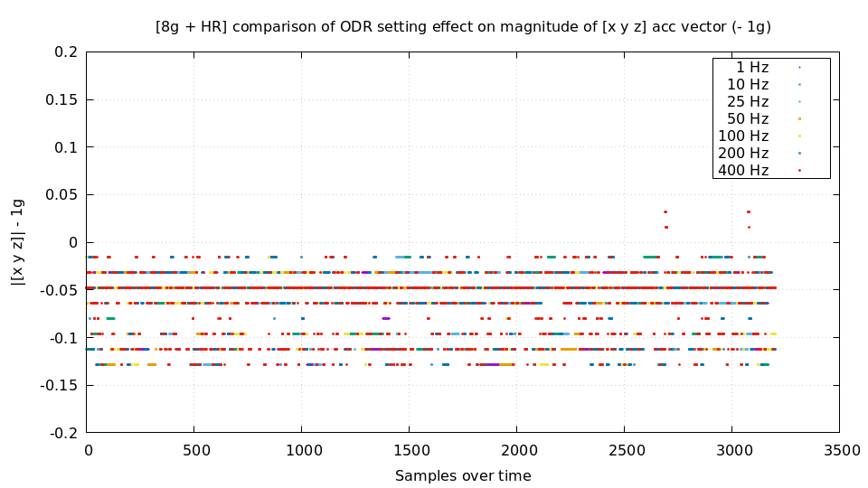
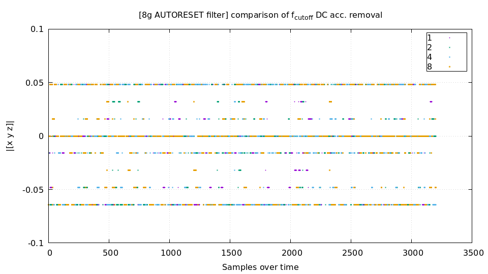
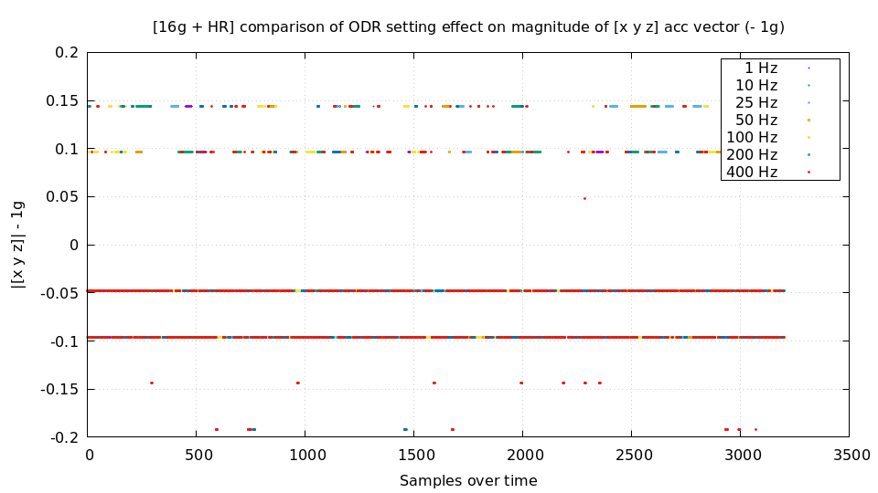
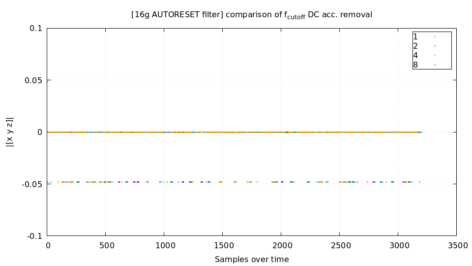

# LIS3DH

A C89 driver for the 3-axis accelerometer LIS3DH by ST. Supports both i2c and SPI. 

> ### Features
> - FIFO of varying watermark level, up to 32
> - HP filter
> - 2G, 4G, 8G and 16G
> - All power modes
> - Interrupt generation (soon)
> - Free-fall detection (soon)
> - Single and double click detection (soon)
> - 4D/6D orientation detection (soon)

FIFO output example

```
$ ./lis3dh 
x: 0.5320, y: -0.8800, z: -0.0600 mag: 1.0301
x: 0.5440, y: -0.8680, z: -0.0760 mag: 1.0272
x: 0.5440, y: -0.8720, z: -0.0760 mag: 1.0306
x: 0.5440, y: -0.8720, z: -0.0760 mag: 1.0306
x: 0.5440, y: -0.8720, z: -0.0760 mag: 1.0306
x: 0.5440, y: -0.8720, z: -0.0760 mag: 1.0306
x: 0.5440, y: -0.8720, z: -0.0760 mag: 1.0306
x: 0.5440, y: -0.8720, z: -0.0760 mag: 1.0306
x: 0.5440, y: -0.8720, z: -0.0760 mag: 1.0306
x: 0.5440, y: -0.8720, z: -0.0760 mag: 1.0306
x: 0.5440, y: -0.8720, z: -0.0760 mag: 1.0306
x: 0.5440, y: -0.8720, z: -0.0720 mag: 1.0303
x: 0.5480, y: -0.8800, z: -0.0720 mag: 1.0392
x: 0.5480, y: -0.8800, z: -0.0720 mag: 1.0392
x: 0.5480, y: -0.8800, z: -0.0720 mag: 1.0392
x: 0.5480, y: -0.8800, z: -0.0720 mag: 1.0392
x: 0.5480, y: -0.8800, z: -0.0720 mag: 1.0392
x: 0.5480, y: -0.8800, z: -0.0720 mag: 1.0392
x: 0.5480, y: -0.8800, z: -0.0720 mag: 1.0392
x: 0.5480, y: -0.8800, z: -0.0720 mag: 1.0392
x: 0.5480, y: -0.8800, z: -0.0720 mag: 1.0392
x: 0.5480, y: -0.8800, z: -0.0720 mag: 1.0392
x: 0.5480, y: -0.8800, z: -0.0720 mag: 1.0392
x: 0.5480, y: -0.8800, z: -0.0720 mag: 1.0392
x: 0.5480, y: -0.8800, z: -0.0720 mag: 1.0392
x: 0.5480, y: -0.8800, z: -0.0720 mag: 1.0392
x: 0.5480, y: -0.8800, z: -0.0720 mag: 1.0392
x: 0.5480, y: -0.8800, z: -0.0720 mag: 1.0392
x: 0.5480, y: -0.8800, z: -0.0720 mag: 1.0392
x: 0.5480, y: -0.8800, z: -0.0720 mag: 1.0392
x: 0.5480, y: -0.8800, z: -0.0800 mag: 1.0398
x: 0.5480, y: -0.8960, z: -0.0960 mag: 1.0547
```

> ### Notes
> FIFO is always and only 10-bit


### Noise at 2G



### Noise at 4G



### Noise at 8G



### Noise at 16G




## Using i2c on STM32
Simple example code
```c
#define LIS3DH_I2C_ADDR 0x18

int i2c_write(uint8_t reg, uint8_t value) {
	uint8_t buf[2] = { reg, value };
	HAL_I2C_Master_Transmit(&hi2c2, LIS3DH_I2C_ADDR << 1, buf, 2, HAL_MAX_DELAY);
	return 0;
}

int i2c_read(uint8_t reg, uint8_t *dst, uint32_t size) {
	uint8_t send[2] = { reg, 0x00 };
	HAL_I2C_Master_Transmit(&hi2c2, LIS3DH_I2C_ADDR << 1, send, 2, HAL_MAX_DELAY);
	HAL_I2C_Master_Receive(&hi2c2, LIS3DH_I2C_ADDR << 1, dst, size, HAL_MAX_DELAY);
	return 0;
}
```